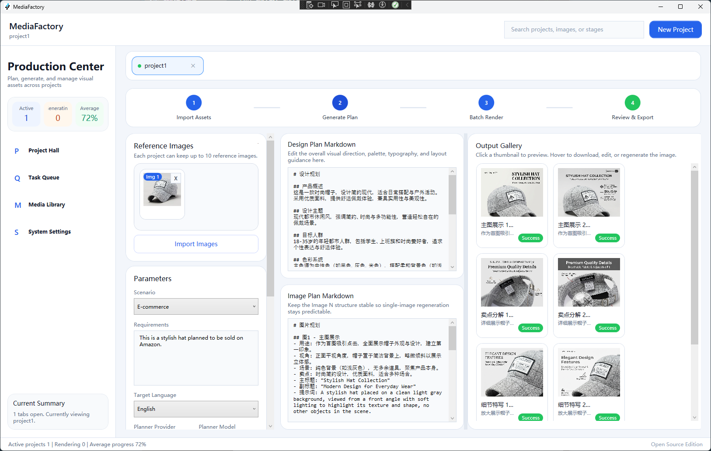
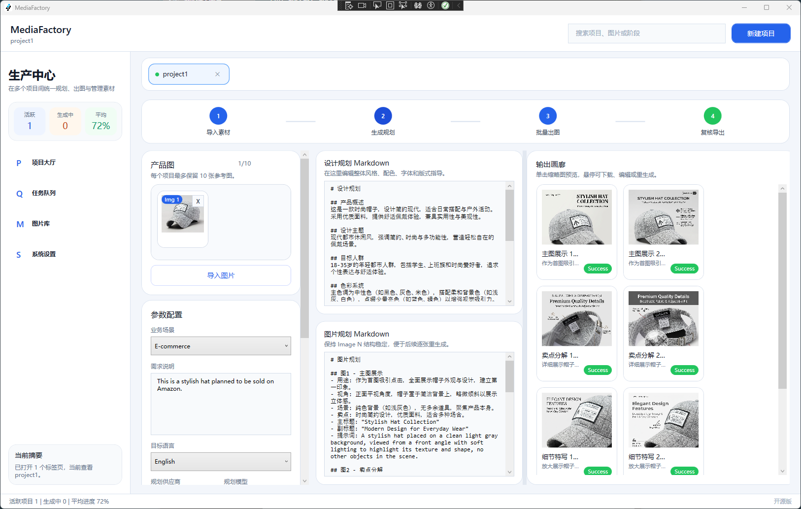
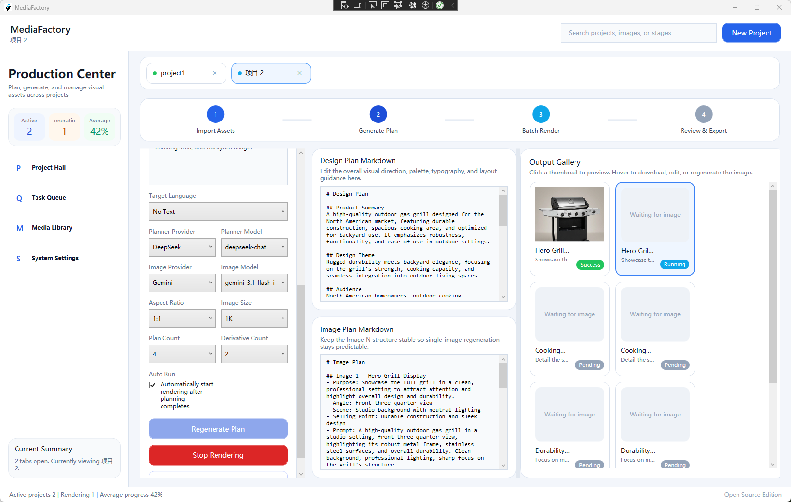
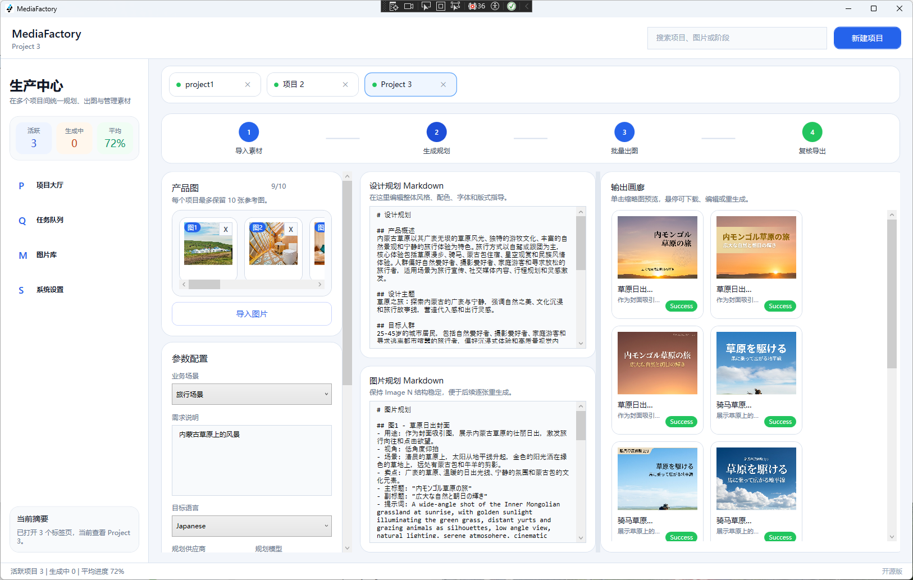
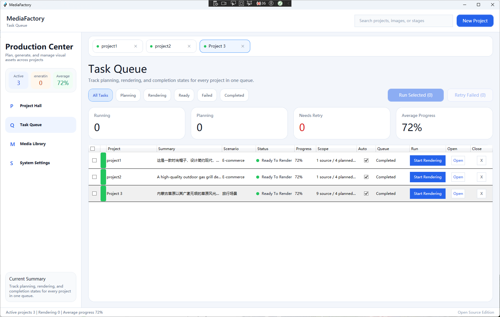
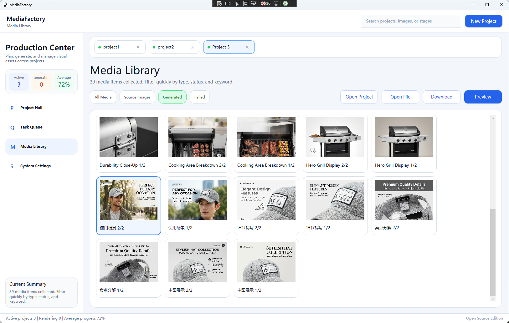
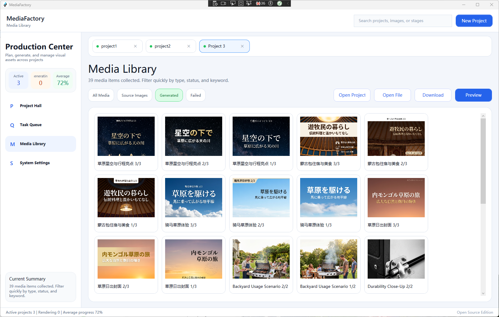
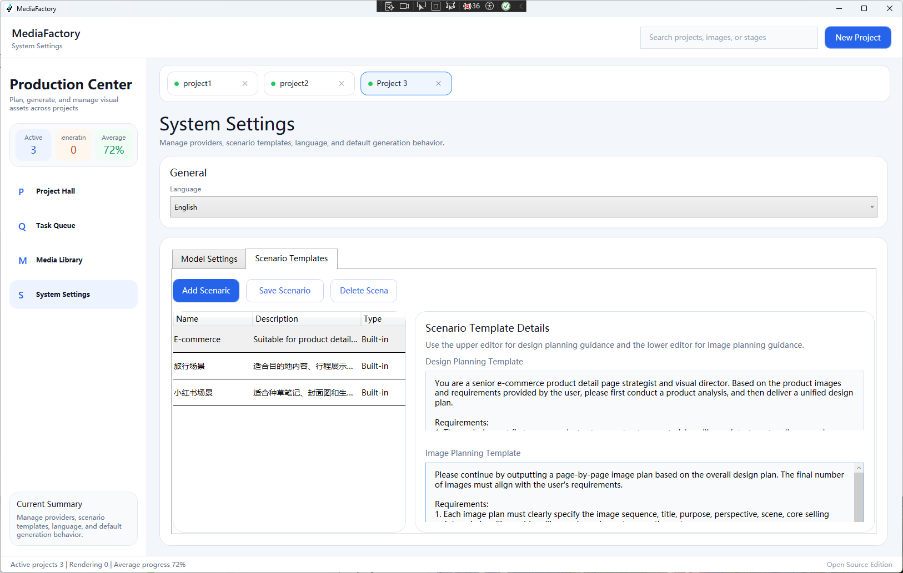
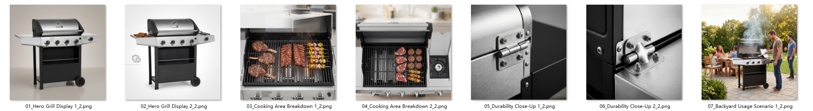
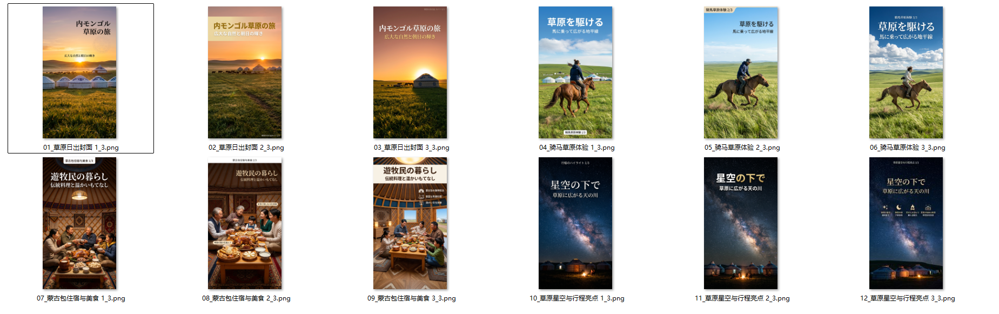

# MediaFactory

[English](#english) | [中文](#中文)

## English

MediaFactory is a WPF desktop application for batch image generation powered by large language models and workflow-based production.

Its biggest strength is simple batch creation: submit one reference image and one short request, then generate a batch of images with the same workflow.

Roles and scenarios can be configured in the system settings. You can define your own scenarios for e-commerce, Xiaohongshu, Zhihu, travel, blogs, and more.

The interface currently supports English and Chinese.

### Highlights

- WPF desktop application built for batch image production
- One reference image plus one simple requirement can drive batch generation
- Scenario and role prompts can be customized in system settings
- Suitable for different content workflows such as e-commerce, social content, travel, and blogs
- English and Chinese UI support

### Screenshots






















### Project Structure

- `MediaFactory.App/`: application source code
- `MediaFactory.slnx`: solution file
- `ModelProviders.json`: provider configuration file

### Configuration

Configure model providers in `ModelProviders.json`.

### Run Locally

```powershell
dotnet build .\MediaFactory.slnx
dotnet run --project .\MediaFactory.App\MediaFactory.App.vbproj
```

## 中文

MediaFactory 是一个基于 WPF 的桌面应用，基于大模型和工作流，批量生成图片的桌面程序。

它最大的特色是批量生成。只需要提交一张参考图片和一句简单的要求，就可以批量生成图片。

角色和场景可以在系统配置中设定，可以配置任意场景，例如电商、小红书、知乎、旅游、博客等等。

界面语言暂时支持中文和英文。

### 功能特点

- 基于 WPF 的桌面应用，面向批量图片生产
- 一张参考图加一句简单要求即可驱动批量生成
- 角色和场景提示词可在系统设置中自定义
- 适用于电商、内容种草、旅游、博客等多种工作流
- 支持中文和英文界面

### 界面截图


### 项目结构

- `MediaFactory.App/`：应用源码
- `MediaFactory.slnx`：解决方案文件
- `ModelProviders.json`：模型提供方配置文件

### 配置说明

模型配置请使用 `ModelProviders.json`。

### 本地运行

```powershell
dotnet build .\MediaFactory.slnx
dotnet run --project .\MediaFactory.App\MediaFactory.App.vbproj
```

## License

MIT
